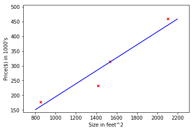

.. _linear_regression:

=================
Linear Regression
=================

.. contents:: :local:

| In statistics, linear regression is a linear approach to modelling the relationship between a scalar response (or dependent variable) and one or more explanatory variables (or independent variables).
| The case of one explanatory variable is called :ref:`simple_linear_regression`. For more than one explanatory variable, the process is called :ref:`multiple_linear_regression`.
| In Machine Learning, we apply the theory, take independent variable as input, try to fit a hypothesis function through data to predict the dependent variable as output.

.. _simple_linear_regression:

Simple Linear Regression
------------------------

.. contents:: :local:

| Simple linear regression also known as "univariate linear regression", it is used when you want to predict a single output value y from a single input value x. 
| Let's start with a simple example, provide a dataset below:

.. csv-table:: House Price
   :file: ../../../dataset/fake_house_price_data.csv

| When we plot out the given data, it seems that the house price has a linear relationship with the size of house.
 Then we can try to find the line that can best fit the data, in our example, it may be the blue line shown below:

Finally, we can use the line (appropriate hypothesis function ) to make predictions.

Now Let's move forward the detail how to solve linear regression problems.

Hypothesis Function
*******************

In simple linear regression model, we use parameters :math:`\theta_0,\theta_1`, the hypothesis function is:

.. math::
   h_{\theta}(x) = \theta_0 + \theta_1 x.

Cost Function
*************

| Cost function is the function that describes predict errors between the real output values and predict values.
| The commonly used cost function :math:`J_{(\theta_0,\theta_1)}` for simple linear regression is :

.. math::
   J_{(\theta_0,\theta_1)} & = \frac{1}{2m} \ \sum_{i=1}^{m} \ (h_{ \theta}(x^{(i)}) \ - \ y^{(i)} )^2 \\ 
   J_{(\theta_0,\theta_1)} & = \frac{1}{2m} \ \sum_{i=1}^{m} \ (\theta_0 + \theta_1 x^{(i)}) \ - \ y^{(i)} )^2

m is the size of the dataset, :math:`x^{(i)},y^{(i)}` is respectively  for input and output values of the i' th sample data in the dataset.

| In regression problems, our goal is to find out the best appropriate hypothesis to predict the output value. We have the hypothesis and  the cost function
 above,our goal will be equivalent to minimize the cost function.
| Because :math:`J_{(\theta_0,\theta_1)}` is a convex function, its minimum value will be at the point which gradient is zero.
| We can use gradient descend algorithm to minimize the cost function. 

Gradient Descend
****************

.. _multiple_linear_regression:

Multiple Linear Regression
--------------------------

.. rubric:: Reference:

#. https://en.wikipedia.org/wiki/Linear_regression
#. https://www.coursera.org/learn/machine-learning/resources/JXWWS
#. http://ml-cheatsheet.readthedocs.io/en/latest/linear_regression.html